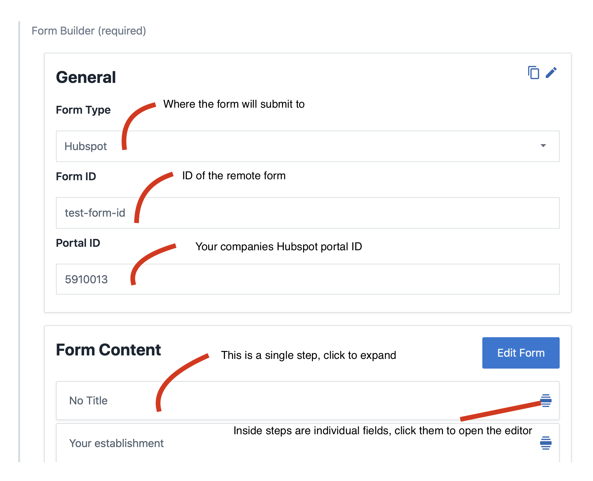

# Table of Contents

1.  [Tutorial](#orgd9319fa)
    1.  [General section](#orgd9cd3d1)
        1.  [Form type](#org2232114)
        2.  [Edit & Copy buttons](#org5fa69bb)
    2.  [Form Setup section](#orgb25958e)
    3.  [Form editor modal](#orgc944880)
        1.  [Creating a step](#orgc94cb16)
        2.  [Creating a field](#org8ea07af)
    4.  [dependsOn](#org0de2f43)
        1.  [Notes on usability](#org038c5d3)
    5.  [Video](#orgf4be3f1)

# Tutorial

## General section

### Form type

gives us the ability to select the form provider (where will the form response be sent)
Upon selecting specific providers we&rsquo;ll be able to input a formId or portalId (hubspot)

### Edit & Copy buttons

The edit button allows to manually edit the JSON, this is an advanced feature as it can be easy
to make a mistake while manually editing the form data.

The copy button copies the raw JSON from the form to enable ease of pasting to another content model.

## Form Setup section

## Form editor modal

When we click on an individual field (or the Edit Form button), we&rsquo;ll be greeted with a modal which looks similar to the following:

### Creating a step

Clicking &ldquo;Add step&rdquo; adds a template step which can be edited by clicking anywhere on the main body of the step.

Clicking on the blue collapse children button will hide or show the children of the step, which can be useful when working on a larg form.
Steps can be re-ordered by dragging the handle on the left side of the step.

Steps can have `dependsOn` logic, please see the appropriate section

### Creating a field

Clicking the small plus button below the last field adds a template field which can be edited by clicking anywhere on the main body of the field.

Fields by default have the following attributes:

- Label (what will be displayed to the user)
- Key (where the value will be saved in the formState)
- Type (which type of field to render to the user)

Fields can have `dependsOn` logic, please see the appropriate section

For some field types, other input fields will appear automatically. For more information on field types please see the documentation here:

[Field documentation](https://github.com/Impossible-Foods/impossiblefoods.com/blob/master/src/components/ModuleForm/DynamicForm/Fields/Fields.org)

## dependsOn

Fields & steps can be toggled on and off by using dependsOn logic.
Currently we use [jsonLogic](http://jsonlogic.com/) which is a JSON enabled programming structure. In future we hope to improve this with a more user-friendly approach.

To begin edit any step or field and click &ldquo;Enable `dependsOn`&rdquo;

You will see a few new text fields appear:

- Depends on
- Tests (if you have added some)

An example of a depends on logic might be the following:

    {
        "!!": { "var": "isCustomBusiness" }
    }

Which would enable the step or field when someone has selected `isCustomBusiness` (which would be set from another field key).

This offers quite a robust and detailed process as we can toggle other items based on more complex logic such as:

    {
      "and": [
        { ">": [{ "var": "age" }, 20] },
        { "==": [{ "var": "gender" }, "male"] },
        { "==": [{ "var": "country" }, "USA"] }
      ]
    }

Which would only enable the step or field if the following are true

- User is older than 20 AND
- User is male AND
- User is in the USA

### Notes on usability

In future we hope to create a simpler UI interface around the dependsOn system which will include commonly used functionality.

## Video

<https://streamable.com/ufuns4>
